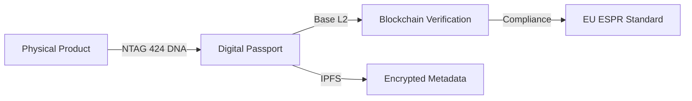

# 00: V-Ledger Summary / Zusammenfassung

## English

### **V-Ledger: The EU-Compliant Digital Product Passport (DPP) Infrastructure**
V-Ledger is an enterprise-grade ecosystem designed to bridge the gap between physical products and digital transparency. By combining high-security NFC hardware with decentralized ledger technology, V-Ledger enables brands to comply with upcoming EU regulations while enhancing product authenticity and circular economy participation.

**Key Pillars:**
- **Compliance:** Ready for EU ESPR 2026/2027.
- **Security:** Hardware-level verification via NTAG 424 DNA.
- **Usability:** Invisible Web3 onboarding for mass-market adoption.
- **Sustainability:** Automated "Pfand" (Deposit) systems for material recovery.

> [!IMPORTANT]
> V-Ledger is not just a tracking tool; it is a financial and regulatory infrastructure for the future of commerce.

---

## Deutsch

### **V-Ledger: Die EU-konforme Infrastruktur für Digitale Produktpässe (DPP)**
V-Ledger ist ein Enterprise-Ecosystem, das die Lücke zwischen physischen Produkten und digitaler Transparenz schließt. Durch die Kombination von Hochsicherheits-NFC-Hardware mit dezentraler Ledger-Technologie ermöglicht V-Ledger es Marken, die kommenden EU-Regularien einzuhalten und gleichzeitig die Authentizität ihrer Produkte sowie die Teilnahme an der Kreislaufwirtschaft zu stärken.

**Kernmerkmale:**
- **Compliance:** Bereit für EU ESPR 2026/2027.
- **Sicherheit:** Verifizierung auf Hardware-Ebene via NTAG 424 DNA.
- **Benutzerfreundlichkeit:** "Invisible Web3" Onboarding für den Massenmarkt.
- **Nachhaltigkeit:** Automatisierte Pfandsysteme für die Rückgewinnung von Wertstoffen.

> [!TIP]
> V-Ledger ermöglicht es Marken, regulatorische Anforderungen in einen echten Wettbewerbsvorteil zu verwandeln.

---
[Next: 01_The_Problem.md](file:///c:/Users/xheen908/1/DPP%20Standart%20Protocol/pitchdeck/01_The_Problem.md)
