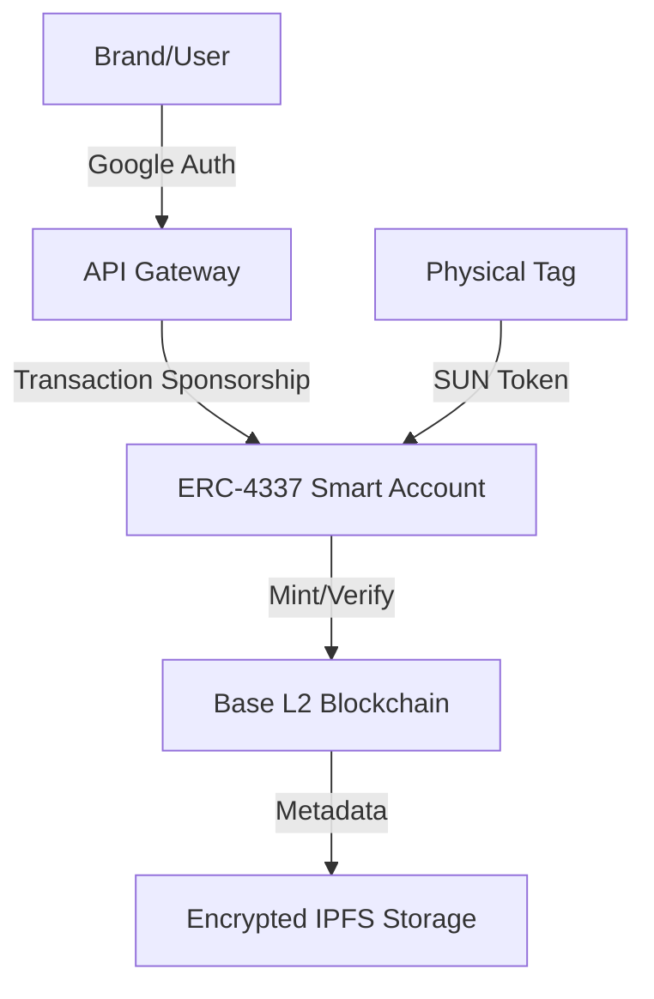

# ⚙️ 03: Technology Stack

## The Engine of Trust: Hardware-Secured Blockchain

V-Ledger is built on a **Web2.5** architecture, combining the high security and decentralization of Web3 with the frictionless user experience of modern SaaS.

<table>
<tr>
<td width="50%" valign="top">

### 💎 Core Components

1. **Hardware: NTAG 424 DNA (NFC)**
   - **Anti-cloning:** SUN tokens provide unique cryptographic proofs.
   - **Security:** Hardened physical security.
2. **Blockchain: Base (Ethereum L2)**
   - **Scalability:** Enterprise-grade performance.
   - **Security:** Inherited from Ethereum.
3. **Abstraction: ERC-4337**
   - **Invisible Wallets:** Social login; no seed phrases.
   - **Gasless UX:** Platform sponsors fees.

</td>
<td width="50%" valign="top">

### 🏗️ System Architecture

</td>
</tr>
</table>

---

🇩🇪 Technik-Details auf Deutsch anzeigen

### **Der Motor des Vertrauens: Hardware-gesicherte Blockchain**
V-Ledger basiert auf einer "Web2.5"-Architektur.

**1. Hardware: NTAG 424 DNA (NFC)**
Schutz vor Klonen durch SUN Tokens und kryptografische Authentifizierung pro Scan.

**2. Blockchain-Layer: Base (Ethereum L2)**
Skalierbarkeit auf Enterprise-Niveau und geringe Latenz bei voller Ethereum-Sicherheit.

**3. Web3 Abstraction: ERC-4337**
"Invisible Web3" Onboarding und Gasless-Transaktionen für maximale Usability.

---
[<< Previous Slide](02_The_Solution.md) | [Back to Overview](README.md) | [Next Slide: 04 Unique Value Props >>](04_Unique_Value_Props.md)
