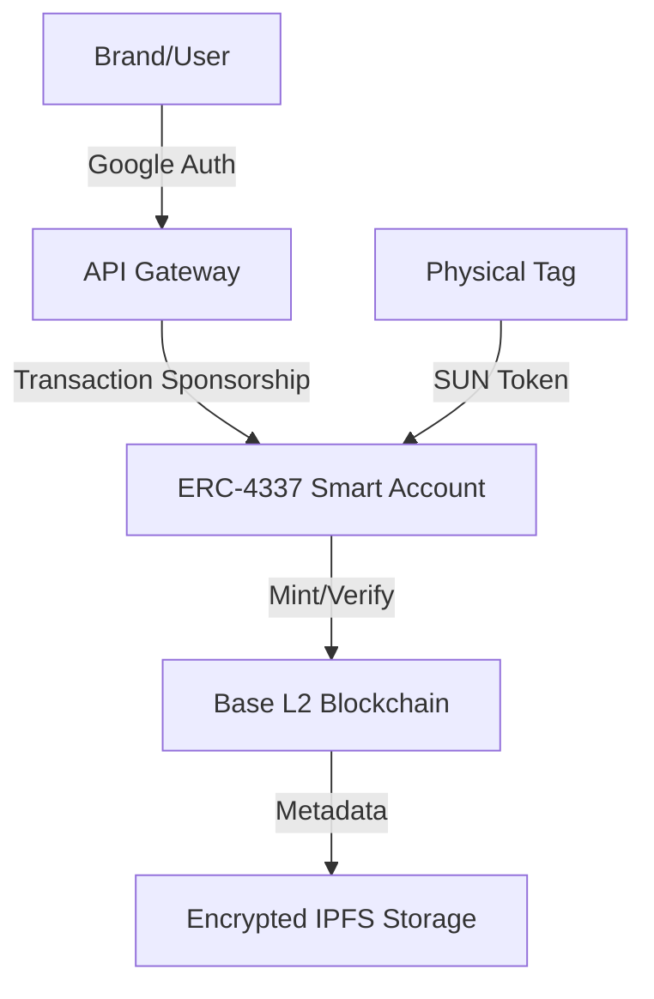

# 03: Technology Stack / Technologie-Stack

## English

### **The Engine of Trust: Hardware-Secured Blockchain**
V-Ledger is built on a "Web2.5" architecture, combining the security and decentralization of Web3 with the user experience of modern SaaS.

**1. Hardware: NTAG 424 DNA (NFC)**
- Anti-cloning protection via SUN (Secure Unique NFC) tokens.
- Cryptographic authentication per scan.
- Hardened physical security for industrial use.

**2. Blockchain Layer: Base (Ethereum L2)**
- Enterprise-grade scalability and low latency.
- Inherited security from the Ethereum mainnet.
- Cost-efficient minting and lifecycle tracking.

**3. Web3 Abstraction: ERC-4337 (Account Abstraction)**
- **Invisible Wallets:** Users log in via Google/Email (Auth Service).
- **Gasless UX:** Transaction fees are sponsored by the platform (Pimlico/Paymaster).
- **Signature Orchestration:** Deterministic key derivation for high security.

---

## Deutsch

### **Der Motor des Vertrauens: Hardware-gesicherte Blockchain**
V-Ledger basiert auf einer "Web2.5"-Architektur, die die Sicherheit und Dezentralisierung von Web3 mit der Benutzererfahrung moderner SaaS-Lösungen kombiniert.

**1. Hardware: NTAG 424 DNA (NFC)**
- Schutz vor Klonen durch SUN (Secure Unique NFC) Tokens.
- Kryptografische Authentifizierung pro Scan.

**2. Blockchain-Layer: Base (Ethereum L2)**
- Skalierbarkeit auf Enterprise-Niveau und geringe Latenz.

> [!NOTE]
> Die Kombination aus Hardware-Sicherheit und dezentraler Verifizierung macht V-Ledger resistent gegen Fälschungen und Datenmanipulation.

---
[Previous: 02_The_Solution.md](file:///c:/Users/xheen908/1/DPP%20Standart%20Protocol/pitchdeck/02_The_Solution.md) | [Next: 04_Unique_Value_Props.md](file:///c:/Users/xheen908/1/DPP%20Standart%20Protocol/pitchdeck/04_Unique_Value_Props.md)
