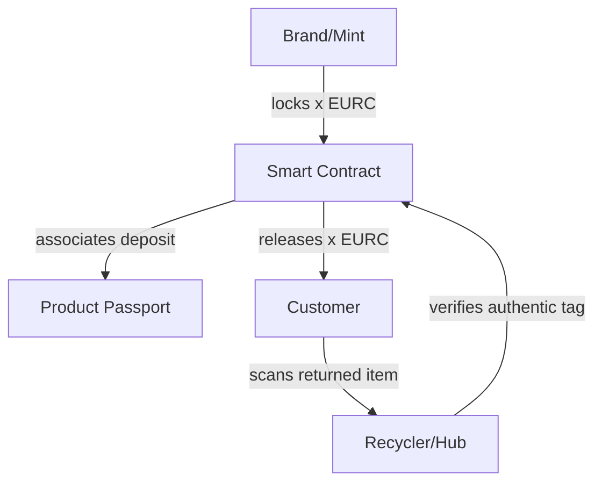
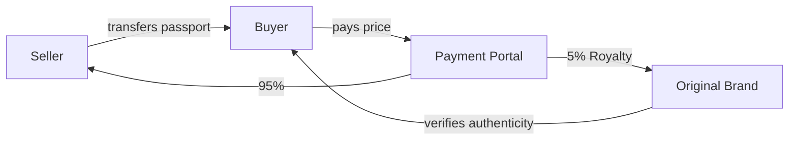

# ♻️ 06: Economy & Incentives

## Dual-Incentive Infrastructure

V-Ledger provides the financial rails to incentivize sustainable behavior for mass-market goods and reward brand value for luxury assets.

### 📈 1. The Pfand (Deposit) System
*Target: Mass-Market, Electronics, Apparel*

### 💎 2. Secondary Market Royalties
*Target: Luxury Watches, Handbags, Limited Editions, High-End Tech*

V-Ledger allows brands to capture a percentage of every resale. When ownership is transferred via the app, the smart contract automatically routes a **Royalty Fee** back to the brand.

**Value for Brands:**
- **Continuous Revenue:** Profit from the increasing value of rare items.
- **Controlled Resale:** Ensure that high-value assets are only traded through verified channels.
- **Customer Insights:** Maintain a connection with the product owner across multiple life stages.

---

🇩🇪 Wirtschaftliche Anreize auf Deutsch anzeigen

### **Infrastruktur für Pfand & Royalties**
V-Ledger bietet zwei zentrale finanzielle Anreizsysteme:

**1. Das Pfandsystem (Mass-Market):**
Sicherstellung der Materialrückführung durch On-Chain hinterlegte Deposits.

**2. Secondary Market Royalties (Luxury):**
Automatische Umsatzbeteiligung der Marke bei jedem Wiederverkauf. Wann immer ein Produkt (z. B. eine Luxusuhr) den Besitzer wechselt, fließt ein prozentualer Anteil des Verkaufspreises direkt zurück an die Marke.

**Vorteile:** Dauerhafte Einnahmen, Markenschutz und Transparenz über den gesamten Lebenszyklus hochwertiger Assets.

---
[<< Previous Slide](05_The_Product_Exosystem.md) | [Back to Overview](README.md) | [Next Slide: 07 Business Model >>](07_Business_Model.md)
