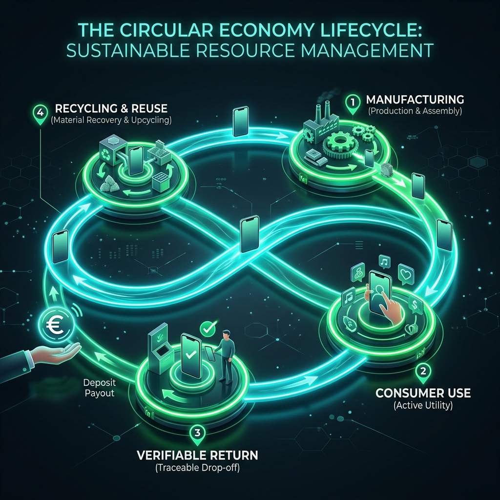

# ♻️ 06: Circular Economy

## Closing the Loop: The V-Ledger Pfand-System

V-Ledger goes beyond simple data tracking by providing the financial infrastructure necessary to incentivize a true circular economy.

### 📈 The Deposit Workflow

### 🗝️ Key Features

#### 1. Automated Deposits (Pfand)
When a product is minted, a designated amount (e.g., 10.00 EURC) can be locked on-chain as a digital deposit. This ensures every item has a residual value.

#### 2. Verifiable Returns
Hardware-level verification ensures only **authentic** items can trigger a payout. This eliminates fraud in global return and recycling systems.

> [!TIP]
> This system transforms "waste" into a trackable asset, creating a transparent and verifiable incentive for global sustainability.

---

🇩🇪 Kreislaufwirtschaft auf Deutsch anzeigen

### **Den Kreislauf schließen: Das V-Ledger Pfandsystem**
V-Ledger bietet die notwendige Finanzinfrastruktur für eine echte Circular Economy.

**1. Automatisiertes Pfand (Deposit):**
On-Chain hinterlegte Beträge (z. B. EURC) schaffen finanzielle Anreize zur Rückgabe.

**2. Verifizierbare Rückführungen:**
Hardware-Verifizierung schließt Fälschungsbetrug im Pfandsystem aus.

**ESG-Compliance:** Marken können ihre Nachhaltigkeitsziele messbar und transparent machen.

---
[<< Previous Slide](05_The_Product_Exosystem.md) | [Back to Overview](README.md) | [Next Slide: 07 Business Model >>](07_Business_Model.md)
