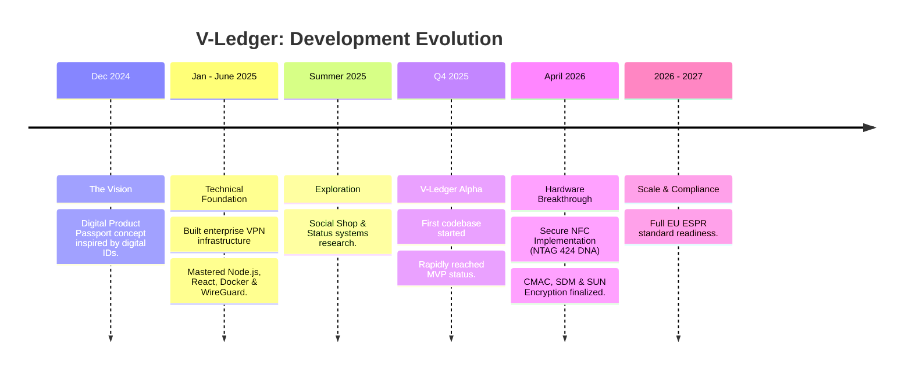

# 🚀 09: Roadmap & Journey

## From Vision to Breakthrough

The journey of V-Ledger is one of constant learning and technical evolution, moving from a conceptual idea to a high-security hardware-integrated infrastructure.

### 🗺️ The Development Journey

### 🎯 Key Milestones & Hardware Integration
- **The Pivot (2025):** Moving from experimental fullstack VPN systems to specialized secure asset tracking.
- **The "Missing Link" (Q4 2025):** V-Ledger software was ready, but high-security hardware integration (NTAG 424 DNA) remained the final hurdle.
- **Hardware Mastery (April 2026):** Leveraged the previously developed **ocpp-toolbox** to implement Kotlin-level secure messaging. Successfully initialized chips with CMAC/SDM encryption and properly structured URLs.

---

🇩🇪 Werdegang & Roadmap auf Deutsch anzeigen

### **Vom Konzept zum Durchbruch**
Die Entwicklung von V-Ledger spiegelt eine intensive technische Evolution wider.

**Der Zeitstrahl:**
- **Dezember 2024:** Die Initialzündung – Die Idee für den DPP, angelehnt an digitale Identitätskonzepte.
- **Nov 2024 - Juni 2025:** Fundament – Bau eines Fullstack VPN-Providers (Node.js, Docker, WireGuard) auf Enterprise-Niveau.
- **Sommer - Dez 2025:** V-Ledger MVP – Erster Codebestand erreicht schnell Funktionsfähigkeit, jedoch fehlte die finale Hardware-Expertise.
- **April 2026:** Der Hardware-Durchbruch – Erfolgreiche Implementierung der CMAC/SDM/SUN-Verschlüsselung auf NTAG 424 DNA-Chips mittels Kotlin und der ocpp-toolbox.

**Zukunft (2026/2027):** Volle Einsatzbereitschaft für die EU-Ecodesign-Verordnung (ESPR).

---
[<< Previous Slide](08_Competition_Market.md) | [Back to Overview](README.md)
