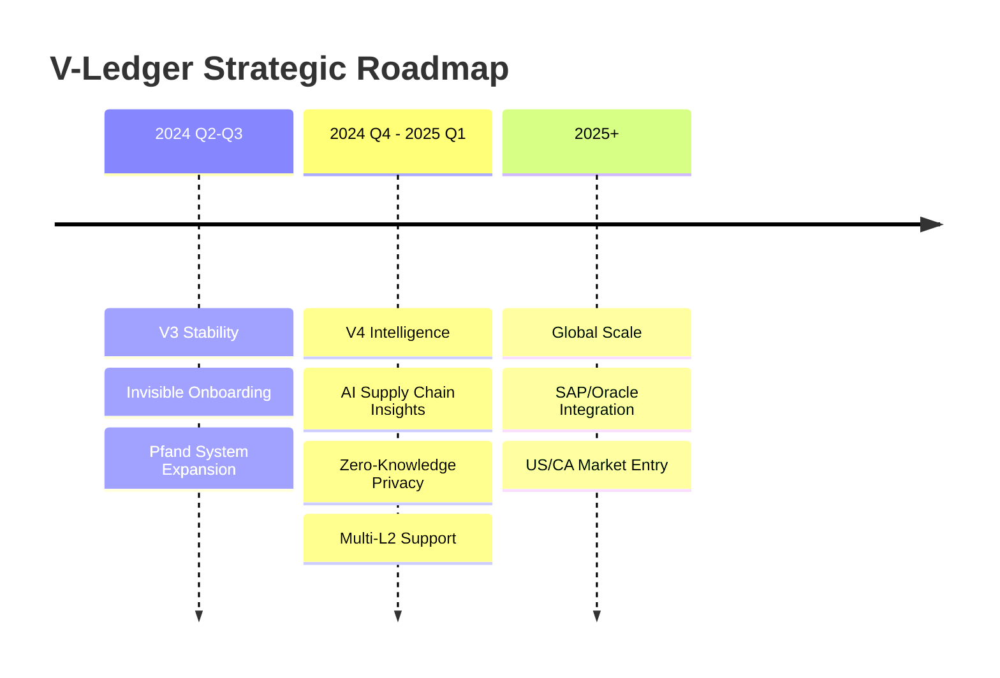

# 09: Roadmap & Future / Roadmap & Zukunft

## English

### **The Path Ahead: V-Ledger V4 and Beyond**
V-Ledger is committed to continuous innovation, ensuring our partners stay ahead of regulatory requirements and technological possibilities.

**Key Milestones:**
- **Q2-Q3 2024:** ERC-4337 finalization and electronics brand pilot.
- **Q4 2024:** V4 release with AI-driven material risk detection.

> [!TIP]
> Our modular architecture allows us to rapidly integrate with legacy ERP systems, making V-Ledger the ideal bridge for enterprise digital transformation.

---

## Deutsch

### **Der Weg nach vorn: V-Ledger V4 und darüber hinaus**
V-Ledger verschreibt sich der kontinuierlichen Innovation.

**Meilensteine:**
- **V3 Stabilität:** Fokus auf Massenmarkt-Usability und Pfandsysteme.
- **V4 Intelligence:** KI-gestützte Risikoerkennung und verbesserter Datenschutz (ZKP).

> [!IMPORTANT]
> Wir sind bereit für die EU-Regulierung 2026/2027 und bieten schon heute die Infrastruktur von morgen.

---
[Previous: 08_Competition_Market.md](file:///c:/Users/xheen908/1/DPP%20Standart%20Protocol/pitchdeck/08_Competition_Market.md)
