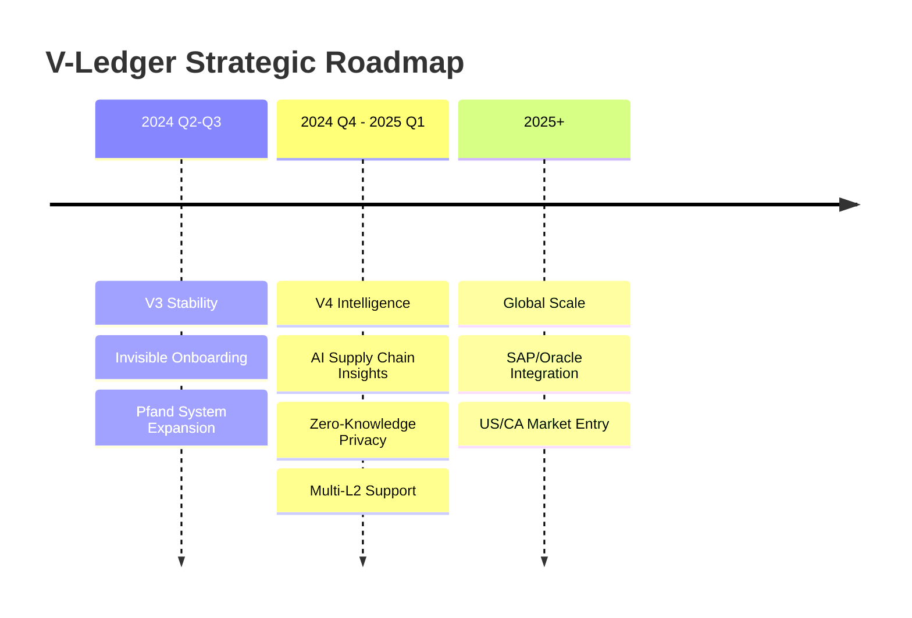

# 🚀 09: Roadmap & Future

## The Path Ahead: V-Ledger V4 and Beyond

V-Ledger is committed to continuous innovation, ensuring our partners stay ahead of regulatory requirements and technological possibilities.

### 🗺️ Strategic Roadmap

### 🎯 Key Milestones & Vision
- **Q2-Q3 2024:** ERC-4337 finalization and pilot project with a leading electronics brand.
- **Q4 2024:** V4 release featuring AI-driven material risk detection and automated ESG reporting.
- **2025 Vision:** Seamless integration with enterprise ERPs (SAP/Oracle) to automate the DPP lifecycle from factory to recycler.

> [!TIP]
> Our modular architecture allows us to rapidly integrate with legacy systems, making V-Ledger the ideal bridge for enterprise digital transformation.

---

🇩🇪 Roadmap auf Deutsch anzeigen

### **Der Weg nach vorn: V-Ledger V4 und darüber hinaus**
V-Ledger verschreibt sich der kontinuierlichen Innovation.

**Meilensteine:**
- **V3 Stabilität:** Fokus auf Massenmarkt-Usability und Pfandsysteme.
- **V4 Intelligence:** KI-gestützte Risikoerkennung und verbesserter Datenschutz (ZKP).
- **2025+:** Globale Skalierung und Integration in Enterprise-Systeme (SAP/Oracle).

**Marktbereitschaft:** Wir sind bereit für die EU-Regulierung 2026/2027 und bieten schon heute die Infrastruktur von morgen.

---
[<< Previous Slide](08_Competition_Market.md) | [Back to Overview](README.md)
