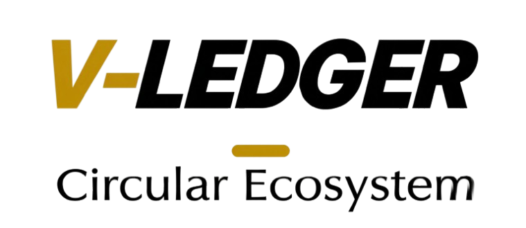
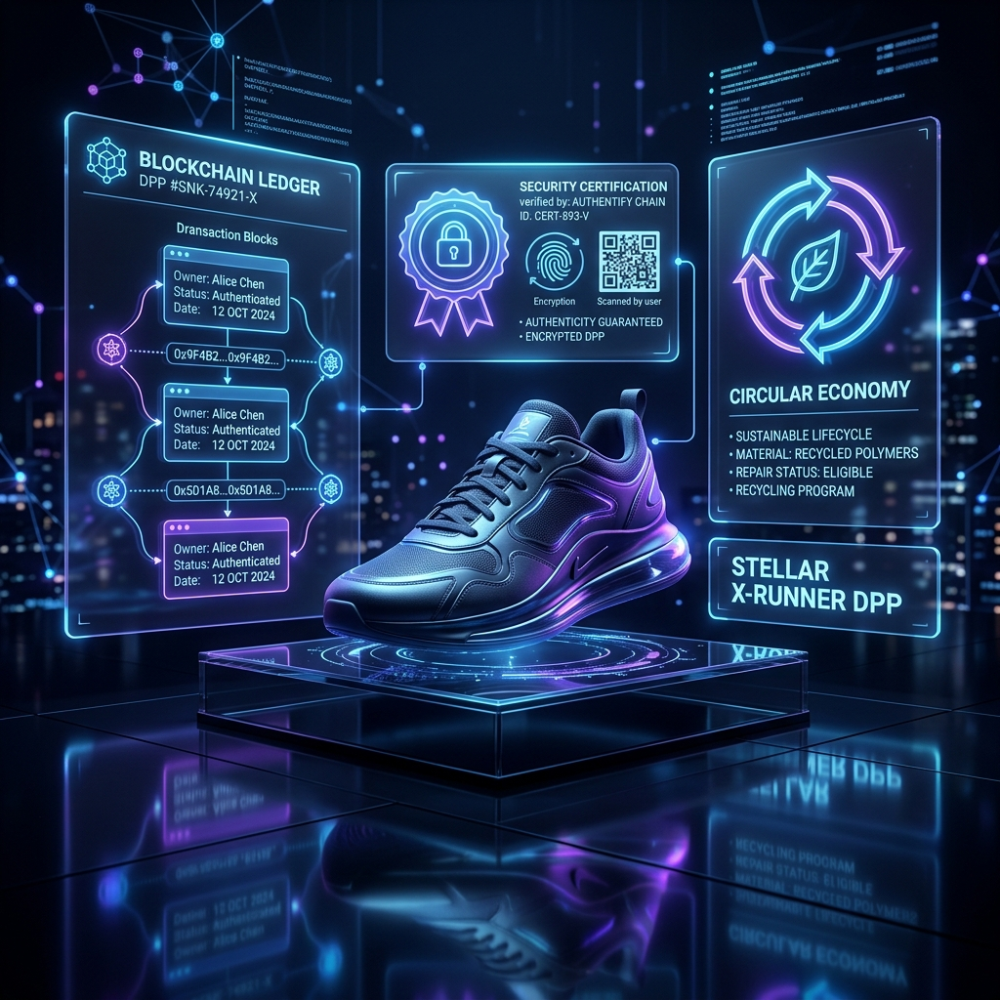
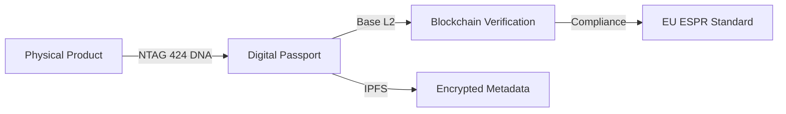

  

# V-Ledger: The EU-Compliant DPP Infrastructure
### Bridging Physical Products & Digital Transparency

**Arndt Christoph Handschuh**  
*Entwickler & Gründer V-Ledger*  
📞 [015258986715](tel:015258986715) | 🌐 [v-ledger.com](https://v-ledger.com) | 📧 [info@v-ledger.com](mailto:info@v-ledger.com)

---

## Overview

V-Ledger is an enterprise-grade ecosystem designed to bridge the gap between physical products and digital transparency. By combining high-security NFC hardware with decentralized ledger technology, V-Ledger enables brands to comply with upcoming EU regulations (ESPR) while enhancing product authenticity and circular economy participation.

### 🗺️ Pitch Deck Navigation

| Slide | Title | Description |
| :--- | :--- | :--- |
| 🔴 **01** | [The Problem](01_The_Problem.md) | EU Compliance & Traceability Gaps |
| 🟢 **02** | [The Solution](02_The_Solution.md) | The V-Ledger Ecosystem |
| ⚙️ **03** | [Tech Stack](03_Technology_Stack.md) | NFC, L2 Blockchain & ERC-4337 |
| ✨ **04** | [Value Props](04_Unique_Value_Props.md) | Security, Usability & Standards |
| 🌐 **05** | [Ecosystem](05_The_Product_Exosystem.md) | Brand Portal & Consumer App |
| ♻️ **06** | [Economy & Incentives](06_Circular_Economy.md) | Deposits & Luxury Asset Royalties |
| 💰 **07** | [Business Model](07_Business_Model.md) | SaaS & Transactional Revenue |
| 📊 **08** | [Market](08_Competition_Market.md) | Competitive Landscape |
| 🚀 **09** | [Roadmap](09_Roadmap.md) | Future Milestones |

---

## 🏗️ Technical Architecture

---

🇩🇪 Zusammenfassung auf Deutsch anzeigen

### **V-Ledger: Die EU-konforme Infrastruktur für Digitale Produktpässe (DPP)**
V-Ledger ist ein Enterprise-Ecosystem, das die Lücke zwischen physischen Produkten und digitaler Transparenz schließt. Durch die Kombination von Hochsicherheits-NFC-Hardware mit dezentraler Ledger-Technologie ermöglicht V-Ledger es Marken, die kommenden EU-Regularien einzuhalten und gleichzeitig die Authentizität ihrer Produkte sowie die Teilnahme an der Kreislaufwirtschaft zu stärken.

**Kernmerkmale:**
- **Compliance:** Bereit für EU ESPR 2026/2027.
- **Sicherheit:** Verifizierung auf Hardware-Ebene via NTAG 424 DNA.
- **Benutzerfreundlichkeit:** "Invisible Web3" Onboarding für den Massenmarkt.
- **Nachhaltigkeit:** Automatisierte Pfandsysteme für die Rückgewinnung von Wertstoffen.

---
[Next Slide: 01 The Problem >>](01_The_Problem.md)
