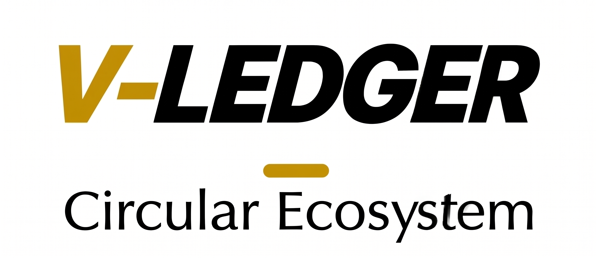
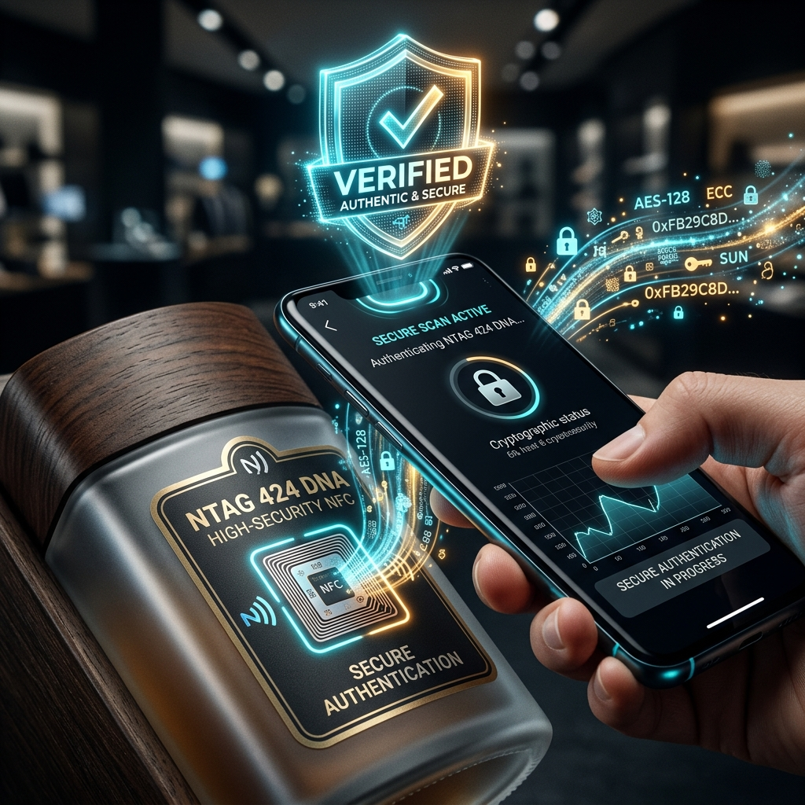
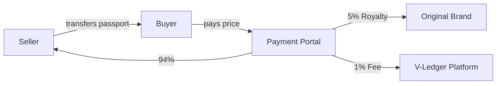

  

# V-Ledger
## The EU-Compliant Digital Product Passport (DPP) Infrastructure

**Arndt Christoph Handschuh**  
*Entwickler & Gründer V-Ledger*  
📞 [015258986715](tel:015258986715) | 🌐 [v-ledger.com](https://v-ledger.com) | 📧 [info@v-ledger.com](mailto:info@v-ledger.com)

---
*Confidentiality Notice: This document contains proprietary information. All rights reserved.*

# 🔴 01: The Problem

## The Challenges of the Modern Product Lifecycle

> [!WARNING]
> Traditional methods of product tracking are no longer sufficient to meet modern security and regulatory standards.

### 1. Regulatory Pressure (EU ESPR)
Upcoming **EU Ecodesign for Sustainable Products Regulation (ESPR)** mandates a Digital Product Passport for most physical goods by **2026/2027**. Non-compliance risks heavy fines and market access restrictions.

### 2. The Counterfeit Epidemic
Global trade in counterfeits costs brands billions annually. Traditional QR codes or basic NFC tags are easily cloned, leading to trust erosion and safety risks.

### 3. Fragmented Lifecycle Data
Once a product is sold, brands lose visibility. Recycling rates remain low because there is no standardized way to verify material composition or incentivize returns.

---

### **Die Herausforderungen des modernen Produktlebenszyklus (DE)**
Globale Marken stehen unter zunehmendem Druck von Regulatoren, Konsumenten und Umweltgruppen, Transparenz über ihre Lieferketten zu schaffen.

**1. Regulatorischer Druck:** EU-Ecodesign-Verordnung (ESPR) bis 2026/2027.  
**2. Fälschungsepidemie:** QR-Codes sind leicht zu klonen.  
**3. Fragmentierte Daten:** Fehlende Sichtbarkeit nach dem Verkauf.

# 🟢 02: The Solution

<table>
  <tr>
    <td width="60%" valign="top">
      <h2>V-Ledger: A Trust-as-a-Service Infrastructure</h2>
      
V-Ledger provides an end-to-end framework for creating, managing, and verifying Digital Product Passports (DPP) with unmatched security and ease of use.

    </td>
    <td width="40%" valign="top">
      
    </td>
  </tr>
</table>

### 🛡️ 1. Secure Digital Identity
Every physical product is assigned a unique, non-clonable digital twin on the blockchain (**Base L2**), secured by an **NTAG 424 DNA** NFC chip.

### 📜 2. Automated Compliance
The V-Ledger protocol automatically generates EU-compliant DPPs, ensuring that all required regulatory data is immutably recorded.

### ♻️ 3. Incentivized Circularity
By integrating a "Pfand" (Deposit) system, V-Ledger creates a financial incentive for customers to return or recycle products.

### ⚡ 4. Frictionless Interaction
Built with **Account Abstraction (ERC-4337)**, allowing brands and consumers to interact with the blockchain effortlessly.

---

### **V-Ledger: Trust-as-a-Service Infrastruktur (DE)**
V-Ledger bietet ein End-to-End-Framework für digitale Produktpässe (DPP). Eindeutige digitale Zwillinge auf der Blockchain (Base L2), gesichert durch NTAG 424 DNA. Account Abstraction sorgt für ein Web2-ähnliches Erlebnis ohne Krypto-Hürden.

# ⚙️ 03: Technology Stack

<table>
<tr>
<td width="50%" valign="top">

### 💎 Core Components

1. **Hardware: NTAG 424 DNA (NFC)**
   - **Anti-cloning:** SUN tokens provide unique cryptographic proofs.
   - **Security:** Hardened physical security.
2. **Blockchain: Base (Ethereum L2)**
   - **Scalability:** Enterprise-grade performance.
   - **Security:** Inherited from Ethereum.
3. **Abstraction: ERC-4337**
   - **Invisible Wallets:** Social login; no seed phrases.
   - **Gasless UX:** Platform sponsors fees.

</td>
<td width="50%" valign="top">

### 🏗️ System Architecture

  

</td>
</tr>
</table>

---

### **Technik-Details (DE)**
V-Ledger basiert auf einer "Web2.5"-Architektur. NTAG 424 DNA bietet Schutz vor Klonen, während Base (L2) für Skalierbarkeit sorgt. ERC-4337 ermöglicht unsichtbare Wallets und gaslose Transaktionen für maximale Usability.

# ✨ 04: Unique Value Propositions

## Why Choose V-Ledger?

> [!TIP]
> Our focus is on making the technology "invisible" to the end-user while providing maximum security for the brand.

### 🌟 1. No-Crypto Onboarding (Invisible Web3)
Logins via social accounts and gasless transactions mean **zero learning curve** for brands and customers.

### 🔒 2. Anti-Counterfeit Hardware Lock
NTAG 424 DNA ensures that the digital passport cannot be decoupled from the physical product or copied.

### 🕵️ 3. Privacy by Design
Sensitive supply chain data is encrypted (AES-256) before being uploaded to IPFS. Only authorized holders can decrypt product details.

### 💰 4. Lifecycle Monetization
Automated **secondary market royalties** and incentivized recycling create a perpetual revenue stream.

---

### **Alleinstellungsmerkmale (DE)**
V-Ledger bietet Onboarding ohne Krypto-Hürden, echtes Anti-Counterfeit durch Hardware-Bindung und datenschutzkonforme Speicherung (AES-256). Durch automatisierte Royalties verdienen Marken an jedem Wiederverkauf mit.

# 🌐 05: The Product Ecosystem

### 🏢 1. Brand Console
*Manufacturing Control:* Mint new DPPs at scale and track supply chain analytics in real-time.

### 🏪 2. Merchant Interface
*Activation & Verification:* Instantly verify authenticity using any mobile device—no special hardware required.

### 📱 3. Customer Passport Portal
*Engagement:* Access origin stories, claim ownership, and interact with Circular Rewards (Pfand).

### 🛡️ 4. Compliance & Authority Gateway
*JSON-LD Export:* Standards-compliant data output for seamless integration with EU surveillance systems and Customs (Zoll).

---

### **Ökosystem-Schnittstellen (DE)**
V-Ledger verbindet alle Stakeholder: Vom Marken-Dashboard über das Händler-Portal bis zum Kunden-Passport. Die JSON-LD Schnittstelle sorgt dabei für volle Kompatibilität mit Behörden und dem EU-Zoll.

# ♻️ 06: Economy & Incentives

## Dual-Incentive Infrastructure

### 📈 1. The Pfand (Deposit) System

  

### 💎 2. Secondary Market Royalties
V-Ledger allows brands to capture a percentage of every resale. When ownership is transferred, the smart contract automatically routes a **Royalty Fee** back to the brand.

---

### **Wirtschaftliche Anreize (DE)**
**Pfandsystem:** Sicherstellung der Materialrückführung durch On-Chain hinterlegte Deposits.  
**Royalties:** Automatische Umsatzbeteiligung der Marke bei jedem Wiederverkauf (z. B. Luxusuhren), was dauerhafte Einnahmen über den gesamten Lebenszyklus generiert.

# 💰 07: Business Model

### 💳 Subscription Tiers

| Tier | Target | Key Features | Price |
| :--- | :--- | :--- | :--- |
| **Starter** | Testing/Prototypes | 25 free mints/month, Basic GS1 Resolver access | **€0** /mo |
| **Essential** | Emerging brands | 500 digital twins included, Standard Support | **€49** /mo + €0.05 per mint |
| **Pro** | SMB Scale-Up | Prioritized SLA, Batch mint API, Event tracking | **€199** /mo + €0.02 per mint |
| **Enterprise** | Global manufacturing | Dedicated manager, Custom gas networks, On-premises | **Custom** |

### 📈 Revenue Components
1. **SaaS Subscription:** Fixed monthly platform access fee.
2. **Minting Fee:** One-time usage fee per Passport created.
3. **Royalty Commission:** Percentage-based fee on secondary market transactions.
4. **Transaction Fee:** Small percentage on circular economy (Pfand) payouts.

---

### **Geschäftsmodell (DE)**
Skalierbare Erlösströme durch monatliche Abonnements und nutzungsbasierte Gebühren (Minting & Transaktionen). Jede Pfandrückzahlung und jeder Wiederverkauf steigert den Lifetime Value des Produkts.

# 📊 08: Competition & Market

<table>
<tr>
<td width="60%" valign="top">

## The Market Demand

The DPP market is projected to reach billions in value as the **EU ESPR regulation** affects over 30 product categories by 2026.

### 📈 Market Drivers
- **Regulatory Deadline:** 2026/2027 mandates forced adoption.
- **Consumer Shift:** 70%+ prioritize verifiable sustainability.
- **Brand Protection:** Global counterfeit growth.

</td>
<td width="40%" valign="top">

</td>
</tr>
</table>

### ⚔️ Competitive Positioning

| Feature | QR / Basic NFC | Legacy Traceability | **V-Ledger** |
| :--- | :--- | :--- | :--- |
| **Security** | ● Low | ● Medium | ● **High (SUN)** |
| **Trust** | ● Low | ● Medium | ● **High (Web3)** |
| **User Exp.** | ● High | ● Low | ● **High (Invisible)** |

---

### **Marktanalyse (DE)**
Der EU-ESPR-Standard erzwingt die Einführung digitaler Pässe. V-Ledger hebt sich durch echte Hardware-Sicherheit und die "Invisible Web3"-Erfahrung von herkömmlichen QR-Godes ab.

# 🚀 09: Roadmap & Journey

  

### 🎯 Key Breakthroughs
- **The "Missing Link":** V-Ledger software was ready by late 2025, but hardware encryption (NTAG 424 DNA) was the final hurdle.
- **Hardware Mastery (April 2026):** Implemented CMAC/SDM/SUN encryption via Kotlin and the ocpp-toolbox.

---

### **Werdegang & Roadmap (DE)**
Vom Konzept 2024 über das technische Fundament 2025 bis zum Hardware-Durchbruch im April 2026: V-Ledger ist nun bereit für die EU-Regulierung 2026/2027 und bietet die notwendige Sicherheit auf Hardware-Ebene.

---

Created by Arndt Christoph Handschuh | v-ledger.com

